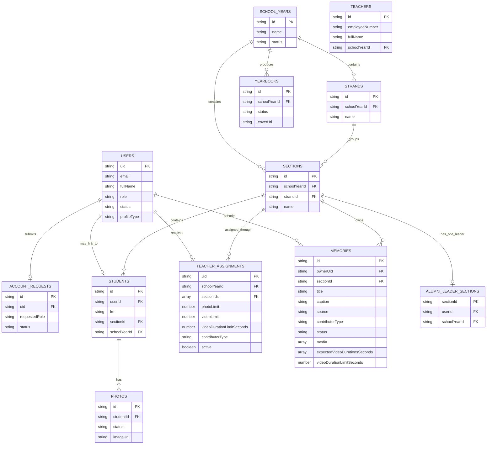

# GradBook Firebase data model

GradBook uses Firebase Authentication for sign-in, Cloud Firestore for application records, Cloud Storage for media, and Cloud Functions for privileged workflows. The relationships below reflect the implemented collections and are suitable as the basis of the project entity relationship diagram.

## Important workflow rules

- `teachers` contains manually created graduation-photo participants. It does not grant login access.
- `teacherAssignments` grants teacher or alumni-leader memory contribution access and stores the administrator-configured limits. New assignments default to 5 photos, 2 videos, and 120 seconds per video.
- `alumniLeaderSections` enforces one alumni leader per section while the person remains visible as a student account.
- Contributor uploads create a `memories` document with `status: pending`. Content Management publishes or rejects that same Firebase record.
- Video duration is checked in the browser before upload and again by the callable Cloud Function before a pending record is reserved. The reported duration and enforced limit are retained in Firestore; each uploaded video also stores its duration in the memory media array.
- Firestore security rules protect administration records. Cloud Functions perform approval, contributor assignment, quota reservation, and other privileged mutations.

## Storage relationships

- `teacher-content/{uid}/{memoryId}/...` stores teacher and alumni-leader memory files. Pending files remain private; published memory files can be read by authorized application users under the Storage rules.
- Student portraits, teacher portraits, yearbook covers, content images, and graduation songs use their existing purpose-specific Storage paths. Their Firestore records retain the related download URL and metadata.
